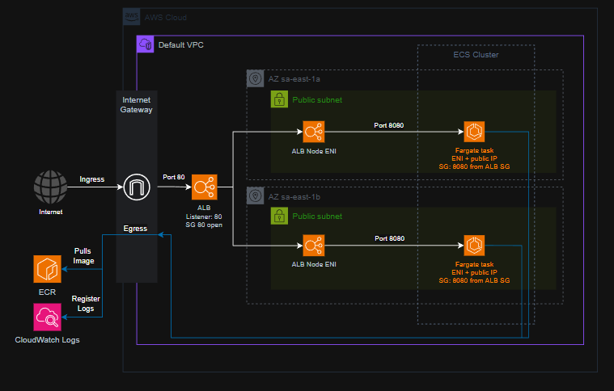
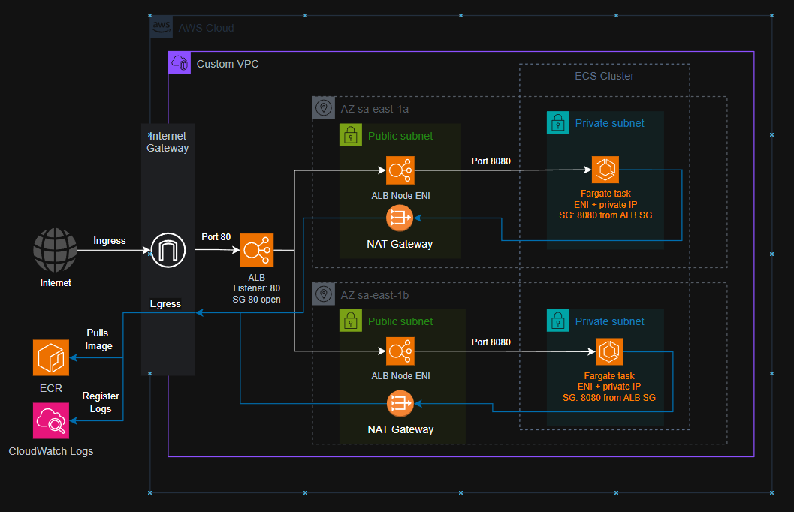
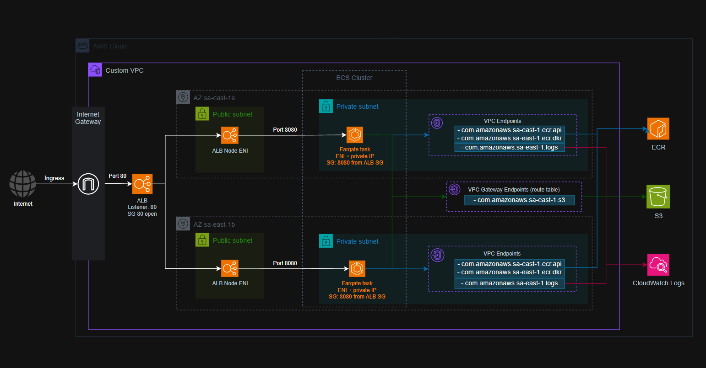

# Lab 7 - Fargate with two instances

The goal for this lab was to deploy two instances of a very simple Spring Boot service using AWS Fargate.

## Preamble

AWS Fargate is an option of computing when configuring a task at ECS (Elastic Container Service). A task definition is the recipe for the ECS start a container service. It tells to the ECS where it will find the container image, environment parameters, logs destination, and the amount of memory/cpu needed for that container. You can have more than one container per task, but when you do that, you are binding them in a way they are going to have the same lifecycle and the same number of replicas.

When configuring your task, you specifically set the compatibility to `FARGATE`. By doing so, you choose to not use EC2 as your computing engine, but the Fargate. It means that, behind the scenes, AWS will provision and manage a micro VM just for that task, with the memory/cpu you configured. You lose the control EC2 gives you, but, you get the aws serverless option to run containers.

### Lab Diagram

As I've been doing in the latest labs, this one also has a quick and cheep architecture in AWS cloud. The diagram below shows the architecture of AWS components to deploy two instances of our spring boot services in Fargate containers.



There are several aspects the diagram shows, and we are going to talk about them now.
1. The entry point to our service in AWS is the Internet Gateway from the Default VPC. It is delivered to us by default when you create an account in AWS, alongside with some public subnets, the ACL list and even route tables configured. In production, as always, you will probably want to create a custom VPC and all the other network parts (IGW, ACL, Route Tables, Subnets).
2. The next point is our Application Load Balancer (ALB). As you will notice, it is behind a Security Group (Instance firewall) that opens the port 80. The ALB balances between two nodes, each one residing in a specific Availability Zone (AZ) and, more precisely, inside a Public Subnet there. Each ALB node has its own Elastic Network Interface (ENI). One thing I've learned in this lab is: Anything that has an ENI is inside a Subnet.
3. The ALB then forwards the request to a Target Group. It is not visible in the diagram, but you will find it in the project set up. The target group can load balance one more time the request if needed between your instances. In our case, it probably won't, because each instance is at a different AZ and, as far as I know, the target group points to instances inside the same AZ. The target group also tracks the ip of the targets, using it to check the health of the instances. With that it knows if the instance is available to receive requests or not.
4. Then we reach the containers. Both of them use the same Security Group configuration, they open the port 8080, but they only listen to requests coming from the ALB Security Group. Also, they are inside a Public Subnet and have their own Public IP. This is a concession made in this lab to allow access to the internet. In a production environment, that would not happen: The instances would be configured in a private subnet, and we would need a NAT Gateway to allow requests getting out to the internet.
5. It is worthy to mention that the ECR and the CloudWatch Logs are inside the VPC, not outside. But still, they are the reason why the container instances need to have access to the internet: they are not available from within without further configurations.
6. Finally, we have the ECS Cluster. The ECS is the AWS containers orchestrator and accepts configurations saying how many instances should be running, what is the task definition and what is the launch type: Fargate or EC2.

### NAT Gateway version

Below, we have an architecture closer to a production version.



Here are the main changes:
1. First, the Fargate tasks are inside Private Subnets. It enhances the security because now the instances cannot have public IPs. The ingress communication now is tighter, just the ALB Security Group can make requests to the containers Security Group.
2. By doing that, the instances lost Internet access, and they need it to pull the container images from ECR and to publish logs to CloudWatch. To fix that, we add a NAT Gateway (per public subnet), creating a route from the instances to the internet. The NAT Gateway ensures that just outbound requests to the internet will be accepted, all inbound will be blocked.

### VPC Endpoints version

Finally, if we need the instances to not be able to make any requests to the internet, then we can remove that NAT Gateways and use the VPC endpoints, since all resources we are using are inside AWS.



In this diagram, we have configured the tasks containers to have access to the following VPC endpoints:

To publish the logs to `CloudWatch`, the endpoint we need is this:
- com.amazonaws.sa-east-1.logs

Endpoints needed to communicate with the Container Registry `ECR`:
- com.amazonaws.sa-east-1.ecr.api
- com.amazonaws.sa-east-1.ecr.dkr

The ECR stores the container images inside `S3` behind the scenes, then we also need access to this VPC Gateway Endpoint:
- com.amazonaws.sa-east-1.s3

Note that the `CloudWatch` and `ECR` endpoints are inside the Private Subnets. It means that they have dedicated ENIs (Elastic Network Interfaces). The `S3` endpoint is outside any Subnet because it is provisioned at the Route Table level, not inside Subnets. It means it doesn't have a dedicated ENI/IP, but a direct route in the network.

## Set Up

After all, we are going to set up the first option, cheaper version and Lab driven architecture.

### Docker image build

```shell
docker build -t lab7-orders:v1 .
```

### Push to Elastic Container Registry (ECR)

```shell
REGION=$(aws configure get region)
ACCOUNT_ID=$(aws sts get-caller-identity --query 'Account' --output text)
REGISTRY=${ACCOUNT_ID}.dkr.ecr.${REGION}.amazonaws.com

aws ecr create-repository --repository-name lab7-orders

aws ecr get-login-password | docker login --username AWS --password-stdin $REGISTRY

docker tag lab7-orders:v1 $REGISTRY/lab7-orders:v1
docker push $REGISTRY/lab7-orders:v1
```

### Create IAM task execution role

```shell
aws iam create-role --role-name lab7-task-execution-role \
   --assume-role-policy-document file://ecs-trust.json

aws iam attach-role-policy --role-name lab7-task-execution-role \
   --policy-arn arn:aws:iam::aws:policy/service-role/AmazonECSTaskExecutionRolePolicy
```

### Create the Cluster, the log group and task definition

```shell
aws ecs create-cluster --cluster-name lab7-cluster
aws logs create-log-group --log-group-name /ecs/lab7-orders
```

Replace the placeholders for `ACCOUNT_ID`, `REGISTRY` and `REGION` in the file [taskdef.json](taskdef.json).

```shell
sed -i 's/<ACCOUNT_ID>/'${ACCOUNT_ID}'/g' taskdef.json
sed -i 's/<REGISTRY>/'${REGISTRY}'/g' taskdef.json
sed -i 's/<REGION>/'${REGION}'/g' taskdef.json
```

Then execute:
```shell
aws ecs register-task-definition --cli-input-json file://taskdef.json
```

### Networking: SGs, ALB, target group

Getting the default VPC and default subnets:
```shell
VPC_ID=$(aws ec2 describe-vpcs --filters Name=is-default,Values=true \
  --query 'Vpcs[0].VpcId' --output text)
SUBNETS=$(aws ec2 describe-subnets --filters Name=vpc-id,Values=$VPC_ID \
  --query 'Subnets[].SubnetId' --output text)

SUBNET_LIST=$(echo $SUBNETS | tr -s '[:space:]' ',' | sed 's/,$//')

echo $SUBNETS
echo $SUBNET_LIST
```

Security Groups:
```shell
ALB_SG=$(aws ec2 create-security-group --group-name lab7-alb-sg \
  --description "ALB ingress" --vpc-id $VPC_ID --query 'GroupId' --output text)

aws ec2 authorize-security-group-ingress --group-id $ALB_SG \
  --protocol tcp --port 80 --cidr 0.0.0.0/0
  
TASK_SG=$(aws ec2 create-security-group --group-name lab7-task-sg \
  --description "Tasks from ALB only" --vpc-id $VPC_ID --query 'GroupId' --output text)

aws ec2 authorize-security-group-ingress --group-id $TASK_SG \
  --protocol tcp --port 8080 --source-group $ALB_SG
```

Create the application load balancer
```shell
ALB_ARN=$(aws elbv2 create-load-balancer --name lab7-alb \
  --subnets ${=SUBNETS} --security-groups $ALB_SG \
  --query 'LoadBalancers[0].LoadBalancerArn' --output text)

TG_ARN=$(aws elbv2 create-target-group --name lab7-tg \
  --protocol HTTP --port 8080 --vpc-id $VPC_ID \
  --target-type ip \
  --health-check-path /actuator/health \
  --health-check-interval-seconds 15 \
  --query 'TargetGroups[0].TargetGroupArn' --output text)

aws elbv2 create-listener --load-balancer-arn $ALB_ARN \
  --protocol HTTP --port 80 \
  --default-actions Type=forward,TargetGroupArn=$TG_ARN
```

### Create the Service

```shell
aws ecs create-service \
  --cluster lab7-cluster \
  --service-name lab7-orders-svc \
  --task-definition lab7-orders \
  --desired-count 2 \
  --launch-type FARGATE \
  --network-configuration "awsvpcConfiguration={subnets=[$SUBNET_LIST],securityGroups=[$TASK_SG],assignPublicIp=ENABLED}" \
  --load-balancers "targetGroupArn=$TG_ARN,containerName=orders,containerPort=8080"
  
aws elbv2 describe-target-health --target-group-arn $TG_ARN \
  --query 'TargetHealthDescriptions[].[Target.Id,TargetHealth.State]' --output table
```

## Test the antipattern

```shell
ALB_DNS=$(aws elbv2 describe-load-balancers --load-balancer-arns $ALB_ARN \
  --query 'LoadBalancers[0].DNSName' --output text)
```

## Clean Up

```shell
aws ecs update-service --cluster lab7-cluster --service lab7-orders-svc --desired-count 0
aws ecs delete-service --cluster lab7-cluster --service lab7-orders-svc --force
aws ecs delete-cluster --cluster labb7-cluster

aws elbv2 delete-listener --listener-arn $(aws elbv2 describe-listeners \
  --load-balancer-arn $ALB_ARN --query 'Listeners[0].ListenerArn' --output text)
aws elbv2 delete-load-balancer --load-balancer-arn $ALB_ARN
aws elbv2 delete-target-group --target-group-arn $TG_ARN

aws ec2 delete-security-group --group-id $TASK_SG
aws ec2 delete-security-group --group-id $ALB_SG

aws ecr delete-repository --repository-name lab7-orders --force
aws logs delete-log-group --log-group-name /ecs/lab7-orders
aws iam detach-role-policy --role-name lab7-task-execution-role \
    --policy-arn arn:aws:iam::aws:policy/service-role/AmazonECSTaskExecutionRolePolicy
aws iam delete-role --role-name lab7-task-execution-role

aws ecs deregister-task-definition --task-definition lab7-orders
aws ecs delete-task-definitions --task-definition lab7-orders
```