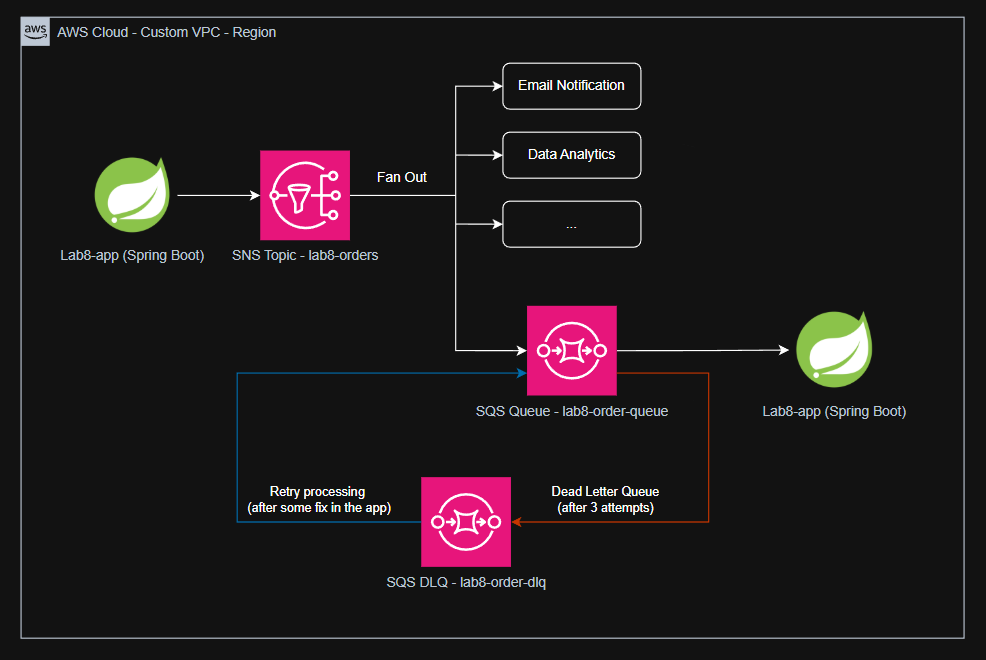

# Lab8 - Messaging with SNS + SQS + Spring Boot

The goal for this lab is to create a common sequence of receiving a message in AWS. The entry point is an SNS topic that fan outs to an SQS queue, delivers it to an application and, if it fails, redirect the message to a DLQ (dead letter queue).

## Preamble

This lab helps to differentiate the Simple Notification Service (SNS) and Simple Queue Service (SQS), while simulating failures in the queue processing.

Below we have a simple architecture diagram showing the lifecycle of the request message. 



First the message is born by a Producer. For simplification, we used this exact Spring boot project to produce and listen to the messages. You will find a rest controller to deal with receiving an Order request and sending it to an Orders topic in the SNS.

The SNS then fans out the message to how many listeners are connected to it. It is the main characteristic of a topic and a queue. A topic can represent a Domain Event that more than one team/application may need to be aware of. One of its destinations is our SQS queue.

The SNS queue is there to buffer the incoming messages, allowing the listener application to process them accordingly with its capacity and availability. Talking about availability, using queues increase the overall availability of systems, once the message requests keep enqueued even if the listener app is off. It will be processed eventually, after the App restarts.

The SNS queue ensures the message will be read "at least once". It is an important fact because the message will not be read "exactly once". Knowing about it enforces we design our App to either idempotent process the messages or ignoring duplicated messages.

In the app we simulated a business logic scenario where the app fails to process some message. When an error occurs, the SQS main queue redirects the message to a DLQ dead letter queue, a place for the failed messages. We've configured the max attempts to 3, then the message is redirected to the DLQ.

The app must acknowledge it has read the message by deleting it from the queue. If the app doesn't delete that message, it will reappear after some configured time (5 seconds in our configuration). This behavior of deleting the message after successfully processing it is wrapped up by the `@SqsListener`, alongside with other features: it delivers out of the box long pooling the queue; try/catch to not delete the messages in case of failure; Json deserialization and more.

During my tests one thing became clear: The standard way of delivering messages are unordered. That happens because AWS can have more than one server delivering the messages. It is good scalability, but does not ensure ordering. If the order matters to your business, then what is recommended is to recreate the SNS topic, the SQS queue and the DLQ queue to be all FIFO. It is not a simple change in the configuration, but all of them would need be recreated.

Last, but not least, it is important to mention the `VisibilityTimeout` configured in the main SQS queue. AWS recommends to use ~6x the time one message takes to be processed. But we have an important tradeoff here: if the time is too short, and the processing takes longer than the `VisibilityTimeout` set, then other instances of your app can see that message and start processing in parallel to the first one; But, the timeout cannot be too long either, because we would not be able to assess if the processing is taking too long, or if the app is down, and you can requeue the message already. So it is a matter of tuning the specific time for your case.

## Set Up

### Create first the Dead Letter Queue (DLQ)

```shell
DLQ_URL=$(aws sqs create-queue --queue-name lab8-order-dlq \
  --query 'QueueUrl' --output text)
DLQ_ARN=$(aws sqs get-queue-attributes --queue-url $DLQ_URL \
  --attribute-names QueueArn --query 'Attributes.QueueArn' --output text)
```

### Create the main Queue

To create the main queue, first replace the `DLQ_ARN` inside the file [queue-definition.json](queue-definition.json) .

```shell
sed -i 's/<DLQ_ARN>/'${DLQ_ARN}'/g' queue-definition.json
```

Now, we can use that definition file to create the queue:
```shell
QUEUE_URL=$(aws sqs create-queue --queue-name lab8-order-queue \
  --attributes file://queue-definition.json \
  --query 'QueueUrl' --output text)
QUEUE_ARN=$(aws sqs get-queue-attributes --queue-url $QUEUE_URL \
  --attribute-names QueueArn --query 'Attributes.QueueArn' --output text)
```

### Create the SNS Topic

```shell
TOPIC_ARN=$(aws sns create-topic --name lab8-orders \
  --query 'TopicArn' --output text)
```

### Connect the Queue to the SNS

First we subscribe the queue to the topic, making it accepts the message in raw format (without the SNS wrapping). 
```shell
aws sns subscribe \
  --topic-arn $TOPIC_ARN \
  --protocol sqs \
  --notification-endpoint $QUEUE_ARN \
  --attributes RawMessageDelivery=true
```

Then, we add the policy to allow SNS send messages to the SQS queue.
```shell
# create the policy string based on the template policy file
POLICY=$(jq -c \
  --arg q "$QUEUE_ARN" --arg t "$TOPIC_ARN" \
  '.Statement[0].Resource = $q 
  | .Statement[0].Condition.ArnEquals["aws:SourceArn"] = $t' \
  sqs-policy.json)


aws sqs set-queue-attributes --queue-url $QUEUE_URL \
  --attributes "$(jq -n --arg p "$POLICY" '{Policy: $p}')" 
```

### Testing the pipes

To check if the messages reach the queue, try to send it to the topic:
```shell
aws sns publish --topic-arn $TOPIC_ARN --message '{"ping": "pong"}'
```
And then read it from the queue:
```shell
aws sqs receive-message --queue-url $QUEUE_URL --query 'Messages[0].Body'
```

The message will reappear in the queue because reading the message does not delete it automatically here:
```shell
aws sqs purge-queue --queue-url $QUEUE_URL
```

## Testing the app

Make sure you create an `.env` file based on the file [.env.example](.env.example) and replace the `TOPIC_ARN` there.

Start the app:
```shell
mvn -q spring-boot:run
```

To check the happy path, send a message like this:
```shell
curl -s -X POST localhost:8080/orders -H "Content-type: application/json" \
  -d '{"customerId":"cust-100","amount":"12,34"}'
```

To check the DLQ path, send a message with an amount over 900 (a simulated business logic in the [OrderListener.java](src/main/java/br/com/flaviohblima/lab8messaging/OrderListener.java)):
```shell
curl -s -X POST localhost:8080/orders -H "Content-type: application/json" \
  -d '{"customerId":"cust-200","amount":"950,00"}'
```

To find that message in the DLQ, we can count and read the message:
```shell
# count
aws sqs get-queue-attributes --queue-url $DLQ_URL \
  --attribute-names ApproximateNumberOfMessages \
  --query 'Attributes.ApproximateNumberOfMessages'
  
# read the message
aws sqs receive-message --queue-url $DLQ_URL --query 'Messages[0].Body'
```

If you want to simulate a fix in the code, remove that simulated "business logic" from [OrderListener.java](src/main/java/br/com/flaviohblima/lab8messaging/OrderListener.java), restart the app, and then try to process it again with this command:
```shell
aws sqs start-message-move-task --source-arn $DLQ_ARN
```

## Clean Up

```shell
SUB_ARN=$(aws sns list-subscriptions-by-topic --topic-arn $TOPIC_ARN \
  --query 'Subscriptions[0].SubscriptionArn' --output text)

aws sns unsubscribe --subscription-arn $SUB_ARN
aws sns delete-topic --topic-arn $TOPIC_ARN

aws sqs delete-queue --queue-url $QUEUE_URL
aws sqs delete-queue --queue-url $DLQ_URL
```